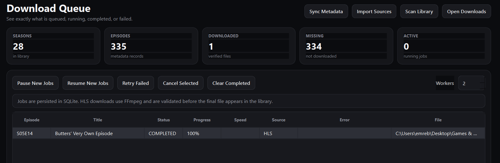
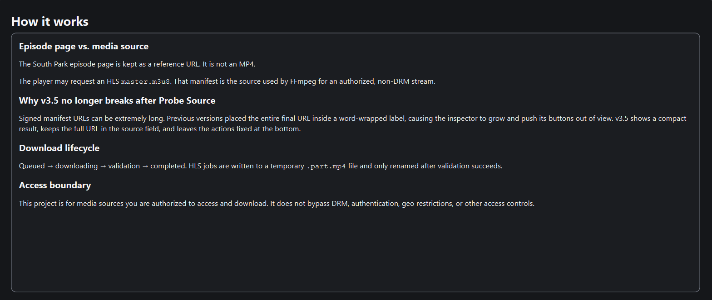

# South Park Downloader

A desktop application for organizing South Park episode metadata, managing authorized media sources, downloading supported streams, and maintaining a clean season-based local media library.

> [!NOTE]
> South Park Downloader is an independent project. It is not affiliated with, endorsed by, or sponsored by Paramount, South Park Studios, or the creators of South Park.
>
> South Park and related names are trademarks of their respective owners.

---

## Current Release

**South Park Downloader v3.7.3**

The latest Windows release is available from the repository's GitHub Releases page.

### Windows downloads

The release provides a Windows installer:

```text
SouthParkDownloader-Setup-3.7.3.exe
```

A portable build can also be distributed separately when available.

---

## Features

South Park Downloader provides a desktop interface for managing episodes and authorized media sources.

### Episode and metadata management

- Browse seasons and episode metadata.
- Synchronize episode information from the metadata provider.
- Keep episode webpages separate from their actual media sources.
- Store source information for individual episodes.
- Scan the local library and reconcile existing media files.
- Organize episodes automatically by season and episode number.

### Media sources

Supported source types include:

- Direct media URLs
- HLS (`.m3u8`) manifests
- DASH source identification and storage

Before downloading, sources can be probed and validated.

HLS downloads are handled through FFmpeg rather than manually downloading and combining individual stream segments.

### Download queue

The application includes a persistent download queue with support for:

- Individual episode downloads
- Full-season downloads
- Downloading all configured missing episodes
- Retry failed jobs
- Cancel queued or running jobs
- Pause/resume queue processing
- Persistent queue state
- Download progress tracking

### Library management

Downloaded files are organized automatically using a season-based structure:

```text
downloads/
├── Season 01/
│   ├── S01E01 - Episode Title.mp4
│   └── S01E02 - Episode Title.mp4
├── Season 02/
│   ├── S02E01 - Episode Title.mp4
│   └── S02E02 - Episode Title.mp4
└── ...
```

Temporary HLS downloads use a `.part.mp4` file while FFmpeg is processing the stream. The resulting media is validated before being moved into its final library location.

### Interface

The application includes:

- Desktop GUI
- Dark and light themes
- Persistent theme preference
- Episode/source configuration
- Download queue interface
- Consolidated status messaging
- Application and installer branding

---

## Screenshots

### Download Queue



### Help and Workflow



---

# Installation

## Windows Installer

The recommended way to install the application on Windows is to download the latest installer from the GitHub Releases page.

The installer:

- Installs South Park Downloader as a normal Windows application.
- Creates the required application files.
- Registers the application with Windows.
- Can create a desktop shortcut.
- Includes the application icon and branding.
- Packages the PyInstaller-built application into a standard Windows installer.

The installer is named:

```text
SouthParkDownloader-Setup-<version>.exe
```

For example:

```text
SouthParkDownloader-Setup-3.7.3.exe
```

---

## Portable Build

A portable build can be distributed without installing the application into Windows.

The portable application is generated by PyInstaller and can be run directly from its extracted directory.

Portable builds are useful if you do not want a traditional Windows installation.

---

# Running From Source

## Requirements

South Park Downloader requires:

- Python 3.11 or newer
- Windows, macOS, or Linux
- Internet access for metadata and remote media sources

FFmpeg is provided through the `imageio-ffmpeg` package, so a separate system-wide FFmpeg installation is normally not required.

---

## Windows

Create a virtual environment:

```powershell
py -3.12 -m venv .venv
```

Upgrade pip:

```powershell
.\.venv\Scripts\python.exe -m pip install --upgrade pip
```

Install the application dependencies:

```powershell
.\.venv\Scripts\python.exe -m pip install -r requirements.txt
```

Run the application:

```powershell
.\.venv\Scripts\python.exe run.py
```

### Windows setup script

The repository also contains a setup script:

```powershell
powershell -ExecutionPolicy Bypass -File .\scripts\setup.ps1
```

After setup:

```powershell
.\.venv\Scripts\python.exe run.py
```

---

## Linux / macOS

Create a virtual environment:

```bash
python3 -m venv .venv
```

Upgrade pip:

```bash
./.venv/bin/python -m pip install --upgrade pip
```

Install dependencies:

```bash
./.venv/bin/python -m pip install -r requirements.txt
```

Run the application:

```bash
./.venv/bin/python run.py
```

---

# First Run

After starting the application:

1. Select **Sync Metadata**.
2. Wait for the episode metadata to populate.
3. Select a season.
4. Select an episode.
5. Enter the episode webpage in **Episode page**.
6. Enter an authorized direct media URL or HLS manifest in **Media source**.
7. Select **Probe Source**.
8. Verify that the source is valid.
9. Select **Save Source**.
10. Queue the episode, season, or all configured missing episodes.
11. Monitor progress from **Download Queue**.

The episode webpage is treated as a reference URL. It is not automatically treated as a direct media download URL.

---

# Episode Pages vs. Media Sources

A normal episode webpage is not necessarily the same thing as the media stream used by the website.

For example:

```text
https://www.southparkstudios.com/episodes/...
```

may contain a modern web player that obtains media through another source.

An authorized HLS source may look like:

```text
https://example.invalid/path/master.m3u8
```

When an authorized HLS manifest is supplied, South Park Downloader passes the manifest to FFmpeg.

FFmpeg handles:

- The HLS playlist
- The individual stream segments
- The media conversion/muxing process
- The final MP4 output

You do not need to manually download and concatenate individual `segment-*` requests.

---

# Access and Usage Boundaries

South Park Downloader is intended for media sources that you are authorized to access and download.

The application does **not** attempt to:

- Bypass DRM
- Extract or recover DRM keys
- Defeat authentication systems
- Circumvent access controls
- Circumvent paywalls
- Circumvent geographical restrictions
- Convert protected playback into an unauthorized download

If a media source requires a protected playback mechanism that the application cannot use, the download job will fail rather than attempting to bypass that protection.

Users are responsible for complying with the terms, laws, licenses, and access restrictions applicable to the media they access or download.

---

# CSV Source Import

South Park Downloader can import source information from CSV files.

The expected columns are:

```text
season,episode,direct_media_url,extension,sha256,episode_page_url,source_kind
```

Example:

```csv
1,1,https://authorized.example/video.mp4,mp4,,https://authorized.example/episode/1,direct
1,2,https://authorized.example/master.m3u8,mp4,,https://authorized.example/episode/2,hls
```

The `source_kind` field can contain:

```text
direct
hls
dash
unknown
```

HLS sources are supported by the downloader.

DASH sources can be identified and stored, but DASH downloading is not currently supported.

---

# Command Line Interface

The graphical interface is the primary way to use South Park Downloader.

Several operations are also available through the command line.

## Synchronize metadata

```powershell
.\.venv\Scripts\python.exe run.py --cli sync
```

## List episodes

```powershell
.\.venv\Scripts\python.exe run.py --cli list
```

## Show the download queue

```powershell
.\.venv\Scripts\python.exe run.py --cli queue
```

## Scan the local library

```powershell
.\.venv\Scripts\python.exe run.py --cli scan
```

## Download a season

```powershell
.\.venv\Scripts\python.exe run.py --cli download-season 5
```

## Download an episode

```powershell
.\.venv\Scripts\python.exe run.py --cli download-episode 5 14
```

---

# Diagnostics

The repository includes diagnostic tools for troubleshooting media and FFmpeg.

## Inspect a media file

```powershell
.\.venv\Scripts\python.exe tools\diagnose_media.py "downloads\Season 05\S05E14 - Episode Title.mp4"
```

## Check bundled FFmpeg

```powershell
.\.venv\Scripts\python.exe tools\ffmpeg_info.py
```

These tools can be useful when investigating invalid media files, failed downloads, or FFmpeg-related problems.

---

# Building a Windows Release

Windows releases are built using:

- PyInstaller
- Inno Setup 6

The PyInstaller specification is located at:

```text
packaging/SouthParkDownloader.spec
```

The Inno Setup installer definition is located at:

```text
packaging/SouthParkDownloader.iss
```

The repository also contains Windows build scripts under:

```text
scripts/
```

---

## Build the Portable Application

From the project root:

```powershell
.\.venv\Scripts\python.exe -m PyInstaller --clean --noconfirm packaging\SouthParkDownloader.spec
```

The resulting application is placed under:

```text
dist\
```

Depending on the PyInstaller configuration, the output may be a single executable or a bundled application directory.

---

## Build the Windows Installer

Install Inno Setup 6 on the development machine.

The command-line compiler is normally located at:

```text
C:\Program Files (x86)\Inno Setup 6\ISCC.exe
```

Compile the installer:

```powershell
& "C:\Program Files (x86)\Inno Setup 6\ISCC.exe" packaging\SouthParkDownloader.iss
```

The resulting installer is written to:

```text
dist\installer\
```

For version 3.7.3:

```text
dist\installer\SouthParkDownloader-Setup-3.7.3.exe
```

---

# Release Process

The release process consists of three main stages:

```text
Source code
    │
    ▼
PyInstaller
    │
    ▼
SouthParkDownloader.exe
    │
    ▼
Inno Setup
    │
    ▼
SouthParkDownloader-Setup-<version>.exe
    │
    ▼
GitHub Release
```

Before publishing a release:

1. Update the project version everywhere it is defined.
2. Update `CHANGELOG.md`.
3. Update `README.md`.
4. Run the test suite.
5. Build the PyInstaller application.
6. Test the generated application.
7. Compile the Inno Setup installer.
8. Test the installer.
9. Create the corresponding Git tag.
10. Push the tag to GitHub.
11. Create or update the GitHub Release.
12. Upload the installer and any other release artifacts.

---

# Testing

Install the development dependencies:

```powershell
.\.venv\Scripts\python.exe -m pip install -r requirements-dev.txt
```

Run the test suite:

```powershell
.\.venv\Scripts\python.exe -m pytest -q
```

A release should not be published until the test suite and the release build have been checked.

---

# Repository Structure

```text
southpark-downloader/
│
├── .github/
│   ├── ISSUE_TEMPLATE/
│   ├── PULL_REQUEST_TEMPLATE/
│   └── workflows/
│
├── app/
│   ├── config/
│   ├── db/
│   ├── gui/
│   ├── models/
│   ├── providers/
│   └── services/
│
├── assets/
│   ├── icon.ico
│   ├── icon.png
│   └── icon.svg
│
├── cache/
├── data/
├── docs/
│   └── screenshots/
├── downloads/
│
├── packaging/
│   ├── SouthParkDownloader.iss
│   └── SouthParkDownloader.spec
│
├── scripts/
│   ├── build_windows.bat
│   ├── build_windows.ps1
│   ├── check_release.py
│   ├── setup.ps1
│   └── setup.sh
│
├── tests/
│
├── tools/
│   ├── diagnose_media.py
│   └── ffmpeg_info.py
│
├── CHANGELOG.md
├── CONTRIBUTING.md
├── LICENSE
├── README.md
├── SECURITY.md
├── pyproject.toml
├── requirements.txt
├── requirements-dev.txt
└── run.py
```

---

# Data and Local Files

Runtime data is stored locally.

The main directories are:

```text
cache/
data/
downloads/
```

The `data/` directory contains the local SQLite database.

The `downloads/` directory contains the managed media library.

These runtime directories are not intended to be committed to the repository.

---

# Versioning

South Park Downloader follows semantic versioning:

```text
MAJOR.MINOR.PATCH
```

For example:

```text
3.7.3
```

Git tags use the `v` prefix:

```text
v3.7.3
```

Version numbers should remain consistent between:

- Application metadata
- Packaging configuration
- Installer configuration
- Release tags
- README
- CHANGELOG
- Any other user-visible version information

---

# Contributing

Contributions, bug reports, and feature requests are welcome.

Before submitting a pull request, please read:

```text
CONTRIBUTING.md
```

For security-related issues, please follow:

```text
SECURITY.md
```

---

# License

South Park Downloader is released under the MIT License.

See:

```text
LICENSE
```

for the complete license text.

---

# Disclaimer

South Park Downloader is an independent software project.

It is not affiliated with, endorsed by, or sponsored by Paramount, South Park Studios, or the creators of South Park.

Users are responsible for complying with all applicable terms, laws, licenses, and access restrictions when using the application.

**Current release: 3.7.3**